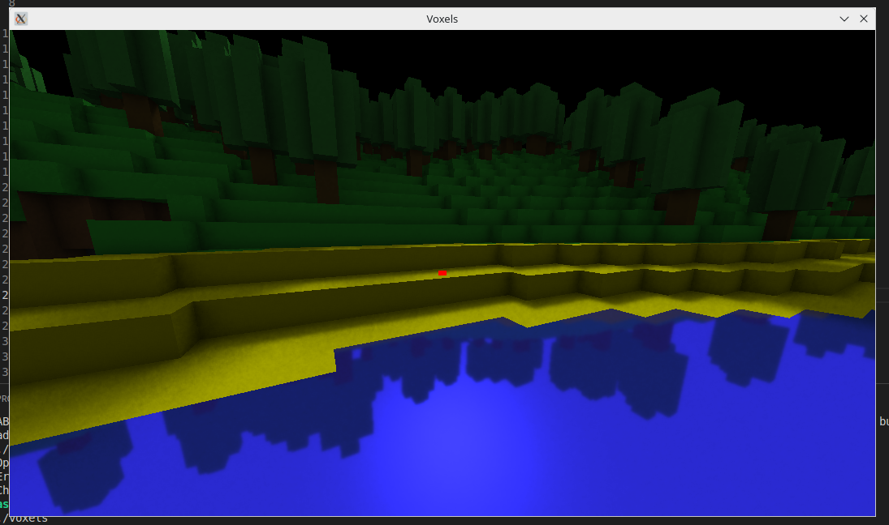
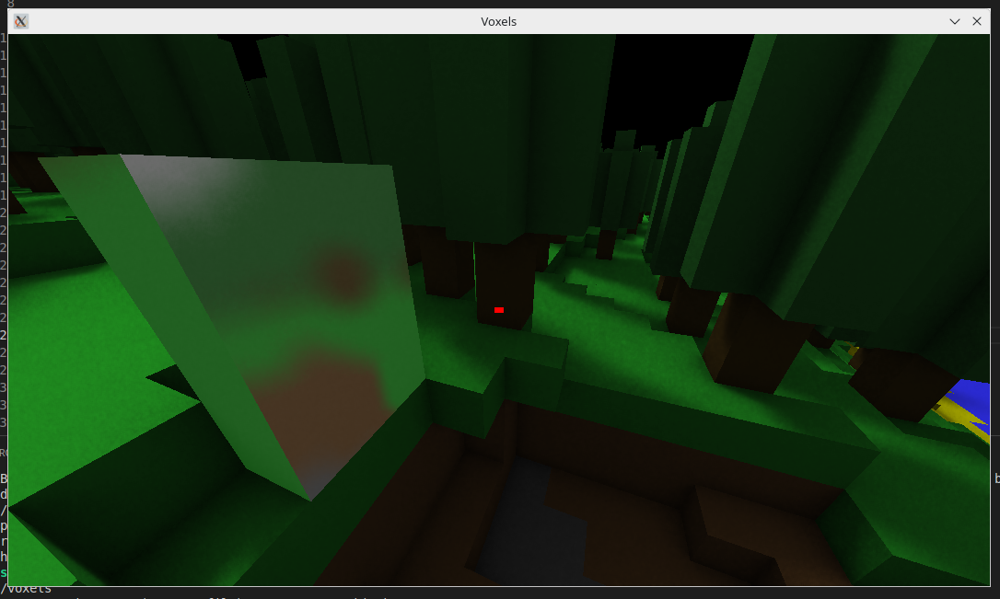
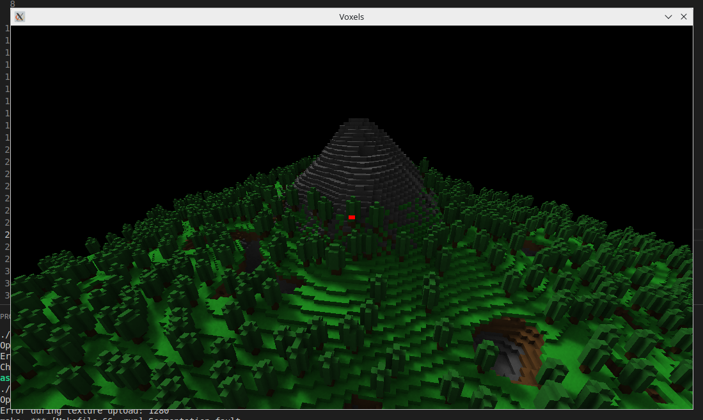

**About the project:** 

This is an experimental voxel engine. It's able to create voxel worlds with procedural generation using perlin noise. 1st edition was made using rasterization, 
but the current version uses raytracing to create good looking and accurate shadows and reflections including blurred reflections.

**Dependencies:**

SDL2, SLD2 image and OpenGL.

**How to run:**

Clone the repository, make sure you have the dependencies installed and run inside the root repo using "make run"

**Demo:**

